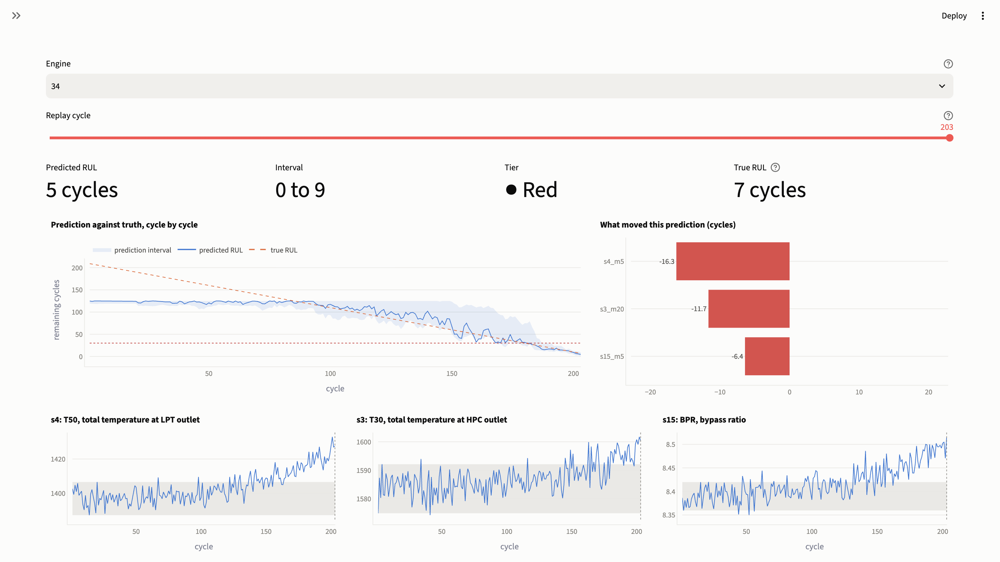
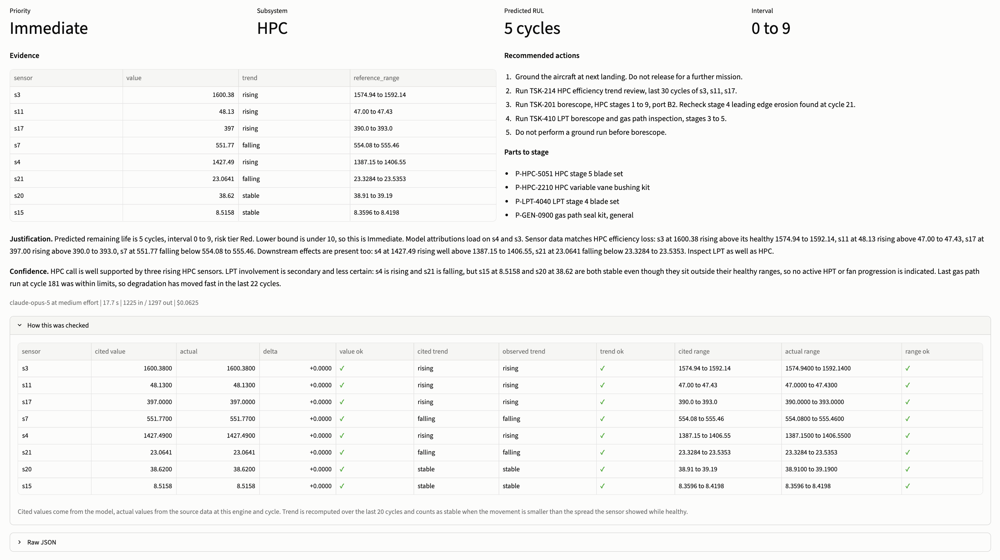
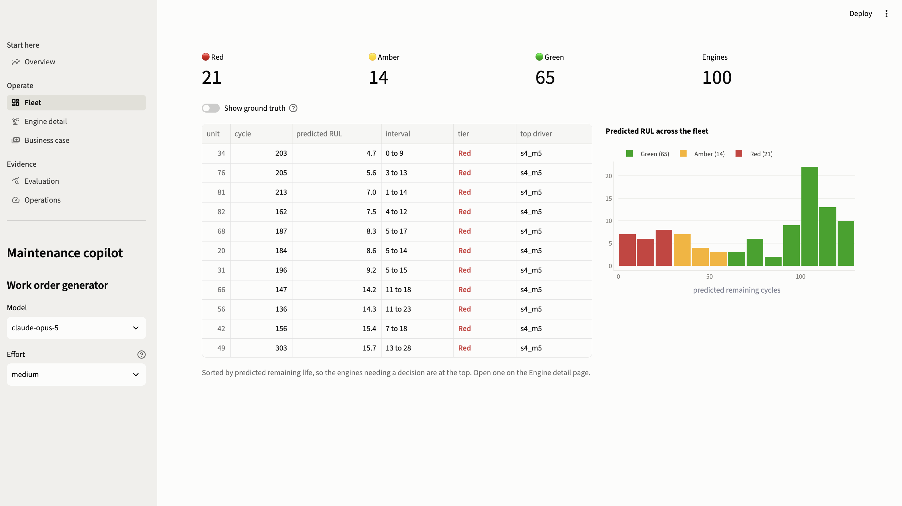
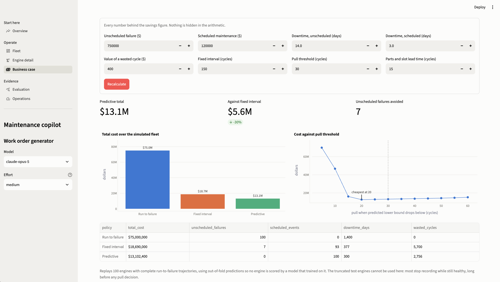
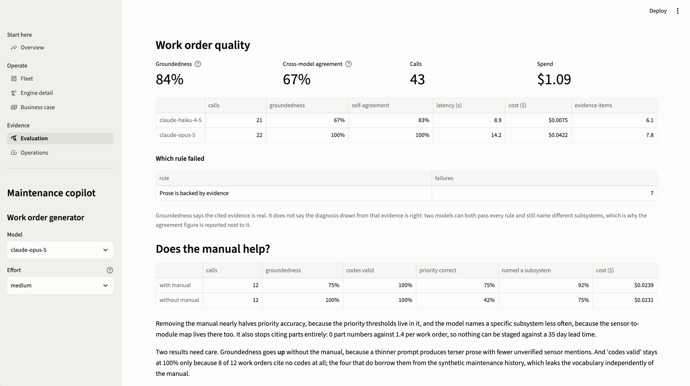
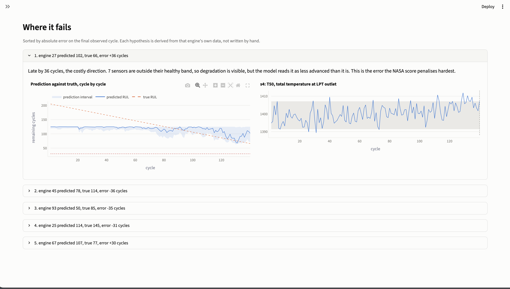

# Predictive maintenance copilot

Predicts remaining useful life for turbofan engines, turns each prediction into a
maintenance work order that cites its evidence, and prices the resulting policy against
the alternatives. "RUL = 42" is not actionable on a flight line, and an RMSE does not
tell a programme manager whether to change how a fleet is maintained.



*One engine replayed cycle by cycle: the prediction converging on truth, the interval
narrowing, and the features moving it.*

## Impact

A 100 engine fleet, moving from a fixed 150 cycle schedule to condition-based pulls:

| Policy | Total cost | Unscheduled failures | Downtime days | Life wasted |
|---|---|---|---|---|
| Run to failure | $75.0M | 100 | 1,400 | 0 cycles |
| Fixed interval | $18.7M | 7 | 377 | 5,700 cycles |
| **Predictive** | **$13.1M** | **0** | **300** | **2,756 cycles** |

**$5.6M saved against the fixed schedule, a 30% reduction, every unscheduled failure
removed and 77 fewer downtime days.** Annualised at 300 cycles per engine per year, that
is $8.1M.

Assumptions are UI inputs, not constants: $750k per unscheduled failure, $120k per
scheduled pull, $400 per wasted cycle, 15 cycle parts lead time.

## Accuracy

| Metric | Result | Target |
|---|---|---|
| Test RMSE | 14.5 cycles | under 15 |
| NASA score | 311 | beat 389 baseline |
| Early warning | 94% | 90% |
| False alarms | 0% | under 10% |
| Interval coverage | 77% | 80% nominal |
| Fleet inference | 12 ms / 100 engines | under 1 s |

| Model | Val RMSE | Test RMSE | NASA | Train |
|---|---|---|---|---|
| Ridge | 18.4 | 16.0 | 389 | 0.01 s |
| **LightGBM** | **15.0** | **14.5** | **311** | 1.9 s |
| 1D-CNN | 16.7 | 15.8 | 405 | 52 s |

Models were chosen on held-out engines; the test set was scored once. Published deep
learning results on FD001 sit around 11 to 14 RMSE, which the small CNN here does not
reach. That makes the production choice easy: the tree model is more accurate, trains in
1.9 s against 52 s, carries its own uncertainty and attributions, and ships as a text file.

## Run it

```bash
uv sync
uv run python scripts/train.py              # downloads data, trains, writes artifacts
uv run pytest
uv run streamlit run src/copilot/app.py
```

Work order generation needs `ANTHROPIC_API_KEY`. Everything else runs offline on CPU.

## Screens

Every number the model cited, checked against source data before the work order is shown.



Triage by predicted life. Ground truth is behind a toggle, off by default, because a planner would not have that column.



The business case, with the cost cliff below 15 cycles where warnings arrive inside the parts lead time.



Work order quality measured, including whether the manual earns its place in the prompt.



The five worst predictions, each with a hypothesis derived from that engine's own data.



## How it works

```
C-MAPSS -> features -> LightGBM (point + quantiles) -> predictions.parquet -> Streamlit
                                                    -> work order (Claude) -> 8 checks
                                                    -> policy simulator
```

`scripts/train.py` computes everything once. The app reads parquet and never loads a
model, so the serving path does not import the training stack.

### Modelling

- Labels are piecewise linear, capped at 125 cycles: degradation is not observable before
  that, so a linear label would teach the model to fit noise.
- Features are per engine: normalised values, rolling mean and spread over 5 and 20
  cycles, a trend term. Seven of 21 sensors are flat in FD001 and dropped.
- Splits are by engine, never by row. Twenty engines held out for validation and
  conformal calibration.
- Uncertainty is quantile regression, conformally calibrated. Raw quantiles covered 69%
  against a nominal 80%; calibration widens them to 77%.
- Attributions are exact TreeSHAP from LightGBM's `pred_contrib`, so no SHAP dependency.

### Work orders and the eight checks

The model gets the prediction, interval and attributions as **fixed input**: it may
explain them, never change them. Structured outputs guarantee schema validity rather
than retrying for it. Then eight rules run before anything is displayed, covering sensor
existence, cited values, trend directions, healthy ranges, prose backed by evidence,
task codes and parts drawn from the manual, and the engine id and prediction unchanged.
A failing work order is flagged, not quietly shown.

| Model | Groundedness | Self-agreement | Latency | Cost |
|---|---|---|---|---|
| Opus 5, medium effort | 100% | 100% | 14.2 s | $0.042 |
| Haiku 4.5 | 67% | 83% | 8.9 s | $0.008 |

*43 calls across 6 engines.* Every failure was the same rule: naming a sensor in the
justification that was not listed in evidence. That rule closes an escape hatch, since a
claim made in prose reaches the reader without passing the value and trend checks. Two
such failures were substantively wrong, including one that called a rising temperature
stable and concluded the module was healthy.

**The manual earns its place, measured not assumed.** Removing it drops priority accuracy
from 75% to 42% and specific subsystem attribution from 92% to 75%, and stops the model
citing parts entirely, so nothing can be staged against a lead time.

### Policy simulator

The simulator runs on **training** engines with out-of-fold predictions, so no engine is
scored by a model that trained on it. Test trajectories are truncated while most engines
are still healthy: 70 of 100 never reach a decision point, and scoring them makes the
predictive policy look three times worse than a fixed schedule for reasons unrelated to
the model.

It also models parts lead time. Deciding to pull an engine is not the same as pulling it,
and without that delay the model rewards an ever lower threshold. With it, the cost curve
has a genuine optimum near 20 cycles and a cliff below 15.

## What is real and what is not

**Real:** the C-MAPSS dataset from NASA's Prognostics Center of Excellence, itself
simulated degradation rather than measurements from hardware. **Synthetic:** the
maintenance logs and the manual in `src/copilot/manual.md`; part numbers and task codes
are invented. **Not included:** integration with any maintenance system, and any
airworthiness judgement. The system recommends, people decide.

## Limitations

- **Groundedness is not correctness.** Every rule can pass while the diagnosis is wrong:
  two models both passed all eight rules on one engine and named different subsystems,
  which is why agreement is reported beside the groundedness rate.
- **Quality is measured automatically only.** No human rubric, no LLM judge, so nothing
  scores whether an action is the right action.
- **Sensor descriptions in prose are unverified.** Paraphrase detection was tried and
  rejected: it flagged 8 of 45 constructions with 1 real error, and tightening the phrase
  boundary removed the true positive along with the false ones.
- **Latency misses target**: 14.2 s on Opus against an 8 s p95 goal. Haiku hits 8.9 s but
  at 67% groundedness.
- **FD001 only**, one operating condition and one fault mode.
- **Interval coverage is 77% against 80% nominal**, structurally: validation labels cap at
  125 cycles while several test engines have more life than that.

## Future work

- **A human rubric and a calibrated judge.** Rate 30 work orders by hand, then calibrate
  an LLM judge against those ratings and report agreement. An uncalibrated judge would be
  the one unverified component in a system built on verification, which is why it is
  absent rather than half-built.
- **FD002 to FD004**, needing per-condition normalisation across six operating regimes.
- **A larger sequence model**: attention over longer windows is the route to 11 to 14 RMSE.
- **Risk tiers calibrated to lead time** rather than fixed cycle counts, so a tier means
  "there is still time to order the part".
- **Real telemetry**: data contracts, sensor drift detection, retraining cadence, and
  integration with a maintenance system of record.

## Layout

| Path | What it does |
|---|---|
| `config.py` | Every threshold, cost assumption, hyperparameter and model id |
| `data.py`, `models.py`, `evaluate.py` | Parsing, features, training, intervals, attributions, replay metrics |
| `workorder.py`, `prompt.md`, `manual.md` | Schema, prompt, LLM call, the eight checks |
| `simulator.py` | Three policies and the cost model |
| `app.py`, `shared.py`, `views/` | Router, cached loaders, one module per page |
| `charts.py`, `theme.py` | Every chart, and the validated palette |
| `scripts/` | `train.py` builds artifacts; `eval_workorders.py` measures work orders |
| `tests/` | Six files by concern |

Anything that can change a reported number lives in the package and is under test;
`scripts/train.py` only wires the pieces together.
